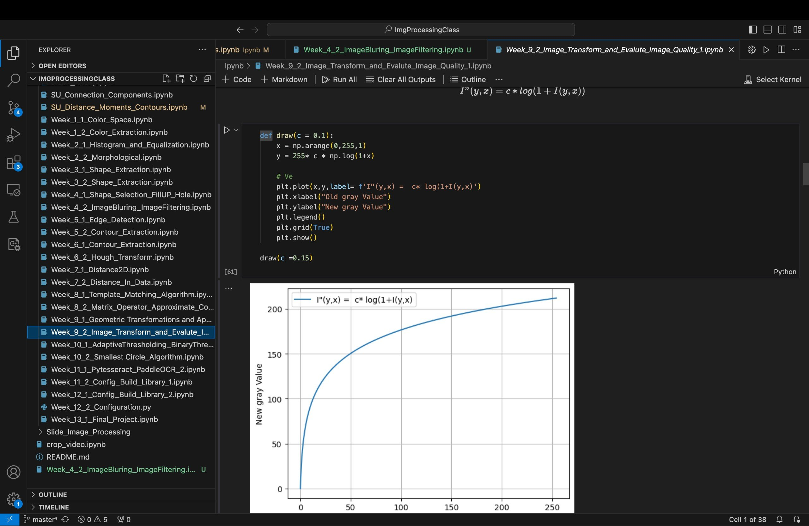
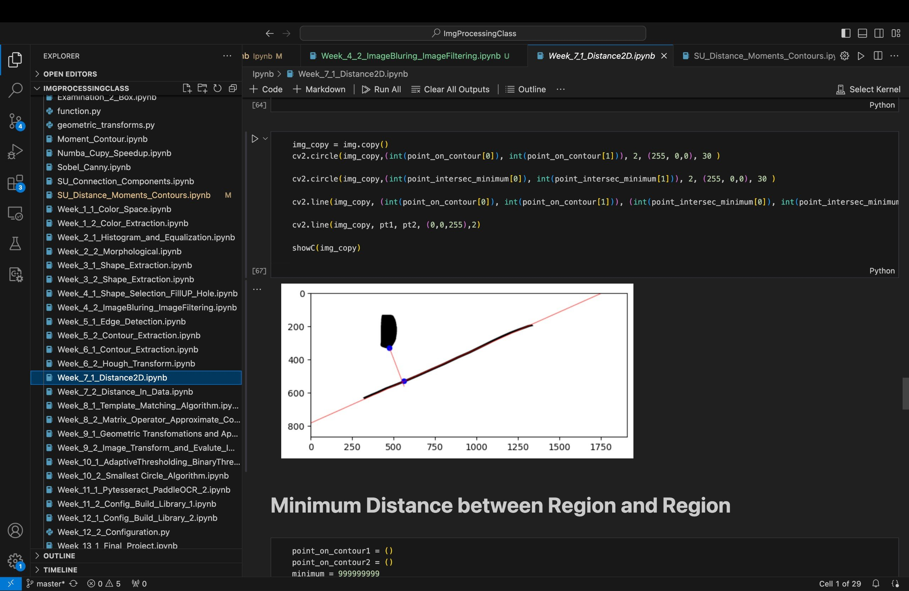
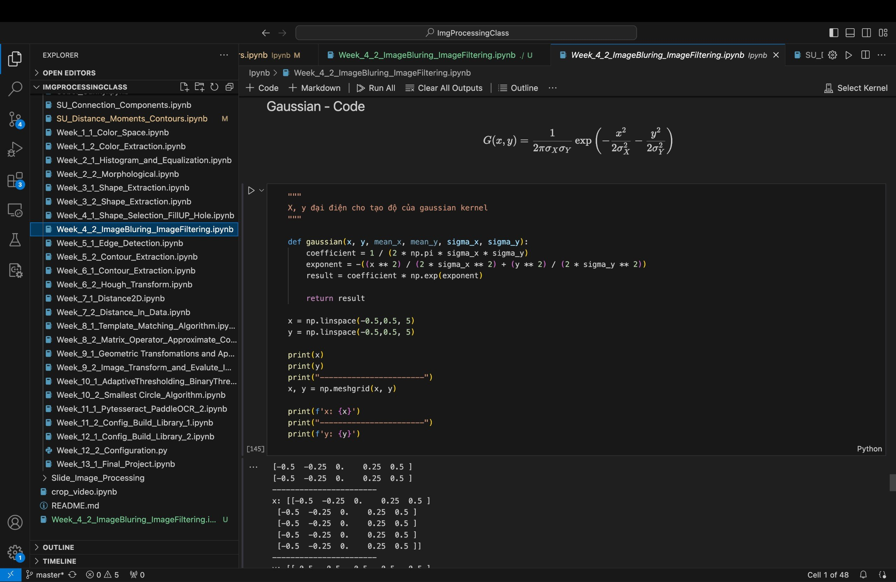
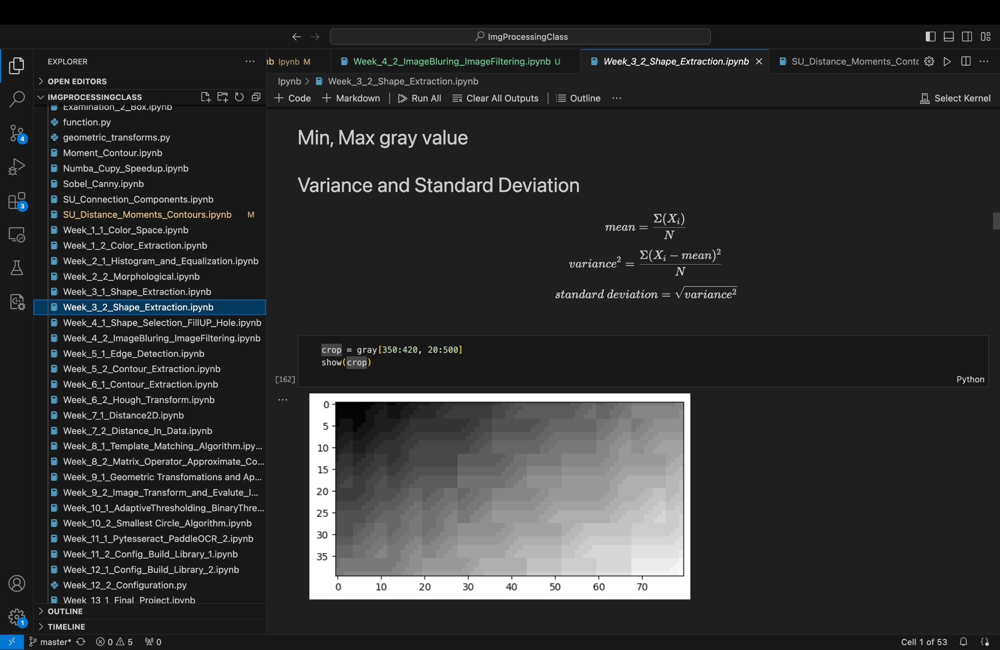
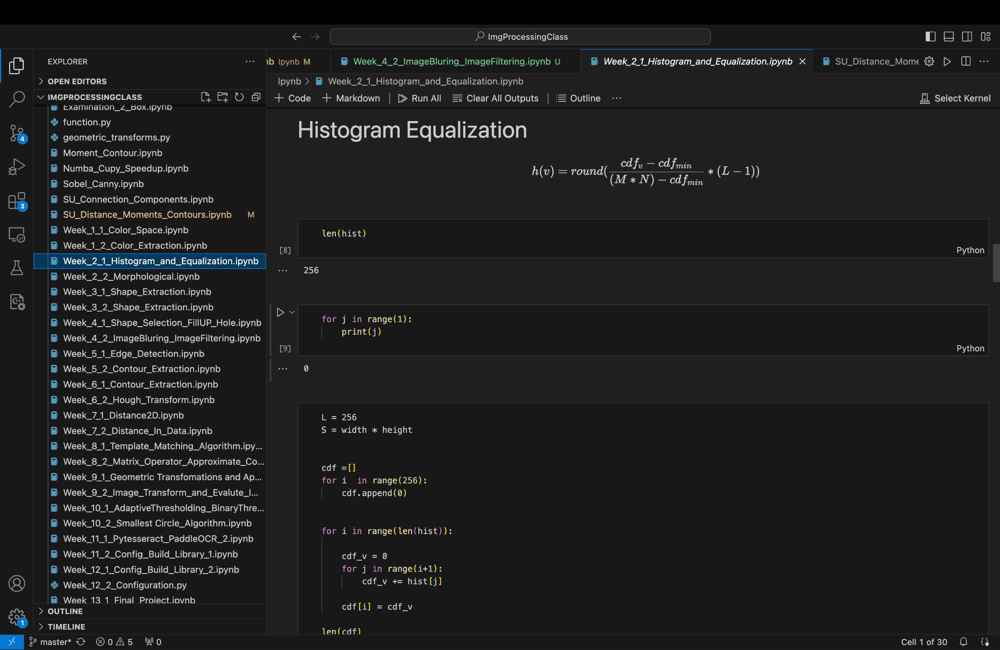
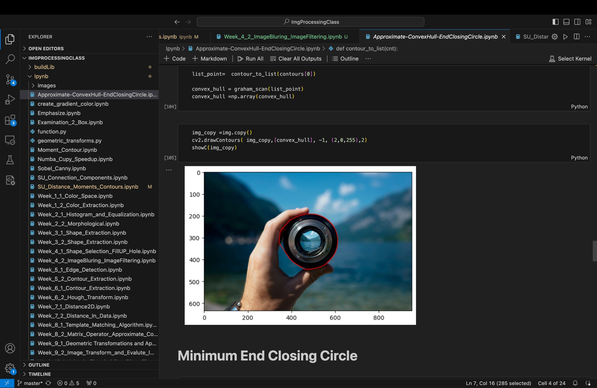
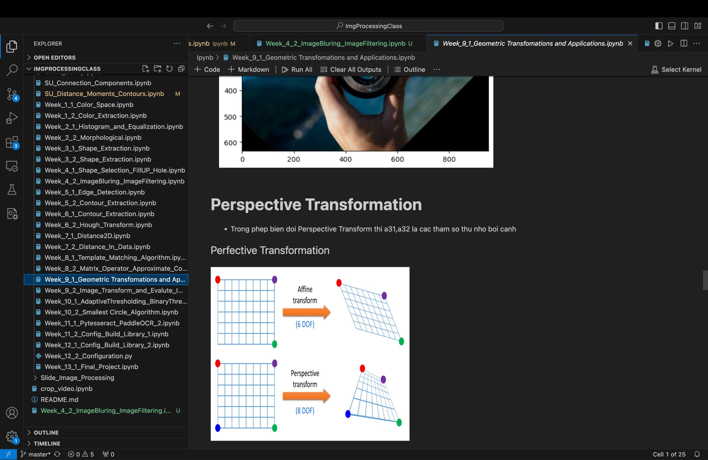

# DesktopApplication
Xây dựng ứng dụng xử lý ảnh trong công nghiệp với C#, WPF and EmguCV.
Khóa học chỉ public 3 bài đầu tiên
## Nội dung khóa học
- **1.** Build Image Processing Applications
- **2.** Connection between Camera and Applications (Basler Camera)
- **3.** Communicate between PLC and Application (TCP/IP)
- **4.** Git management and maintenant
## Clone Code
Để clone source code của khóa học Desktop Applications
```bash
git clone https://github.com/TieuDiem/DesktopApplication.git
```
# Khóa học online xử lý ảnh trong công nghiệp
Học trên visual studio code, python, numpy, matplotlib và opencv 
## Nội dung khóa học
- **1.** Color Space and Color Extraction
- **2.** Bitwise Operation and Thresholding (Global, Range, Adaptive, Binary)
- **3.** Histogram and Equalization
- **4.** Morphological, Struct Element,specially kerner size
- **5.** Image Bluring and Image Smoothing
- **6.** Edge Detection (Canny and Sobel)
- **7.** Shape Extraction (with, heigth, area, circularity, squqness, anisometry,...) and Shape Selection
- **8.** Gray Extraction (mean, variance,standard deviation, entropy,...) and Gray Selection
- **9.** Contour Extraction (area, length, moment, anisometry, circularity,..) and Contour Selection
- **10.** Contours Transformation (Approximate, ConvexHull, Minimum End Closing Circle, ...)
- **11.** Distance in 2-Dimentations (Distance between Point and Point, between Point and Line, between Region and Region, between Point and Region)
- **12.** Template Matching Algorithm
- **13.** Geometrics Transformation (Translation, Shear, Rotation, Scaling,..) and Perspective Transformation 
- **14.** Image Transfomation (Logarit,gamma,...) and Evalue Image Quality (mean, variance, sharpness, entropy,...)
- **15.** Build and upload customize library to [pytest](https://test.pypi.org/)
- **16.** Polar Transformation and Applications
- **17.** [Python] Class and OOP, map, interable and application, Recursive and applications

## Code Representation
<p align="center">
  
  
  
  
  
  
  
  
</p>


## Authors
- [maitrungkien1296@gmail.com](maitrungkien1296@gmail.com)
- [facebook](https://www.facebook.com/thanhvancongchua/)
